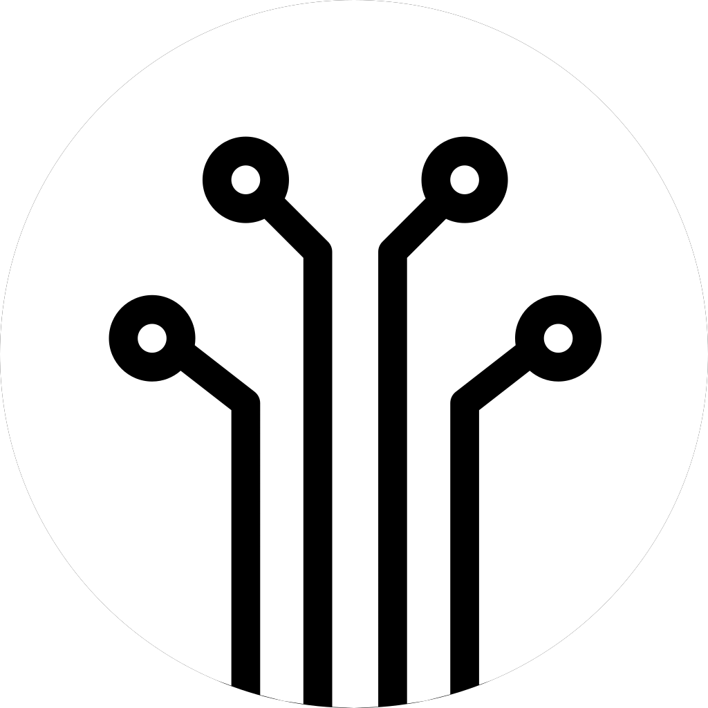
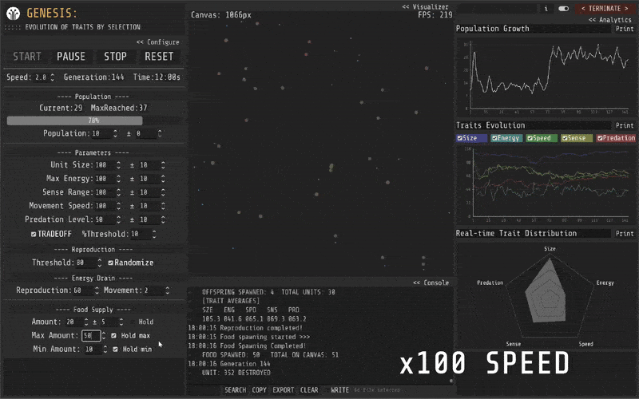

<div align="center">
  
  
  # Genesis - Evolution of Traits by Selection
  
  **A sandbox evolution simulator with trait inheritance and natural selection**
  
  #Evolution #NaturalSelection
</div>

Genesis is a real-time evolution simulator built with Godot Engine that demonstrates how traits evolve through natural selection across generations. Watch digital organisms compete for resources, reproduce, and pass traits to offspring with mutations.



**[Download Genesis at Itch.io](https://bukkbeek.itch.io/genesis)** 
**[Download Readme as a pdf](Documentation/README [PDF].pdf)** 

**📁 This repository contains the Godot project files**

[](https://choosealicense.com/licenses/mit/)
[](https://godotengine.org/)
[]()

---
Genesis simulates a population of digital organisms (units) competing for limited resources (food) within a bounded environment. Through reproduction, trait inheritance, mutation, and natural selection pressures, you can observe how populations evolve over time and how certain characteristics become more or less prevalent.


---
## 🚀 Quick Start

### **For Users (Executables)**
1. Download `Genesis.zip` from [itch.io](https://bukkbeek.itch.io/genesis)
2. Extract and run the executable
3. Click **START** to begin your first evolution experiment

### **For Developers (Godot Project)**
1. **Requirements**: Godot 4.4+ | Windows 10/11 (optimized) | 4GB+ RAM
2. Clone this repository
3. Open `scenes/main.tscn` in Godot Engine
4. Press F5 to run

### **Your First Experiment**
1. Set population: 50-100 organisms
2. Enable trait tradeoffs
3. Set food supply: 30-50 items
4. Adjust speed: 2-3x for faster results
5. Click **START** and watch evolution happen!

---

## 🎯 What Makes Genesis Unique

- **Real-time Evolution**: Watch traits change across generations
- **Five Interconnected Traits**: Size, Energy, Speed, Sense Range, Predatory Behavior
- **Trait Tradeoffs**: Biologically-inspired relationships between traits
- **Advanced Analytics**: Real-time graphing with data export
- **Educational Focus**: Perfect for understanding evolutionary principles
- **Full Customization**: Control every aspect of the simulation

---

## 🧬 The Five-Trait Evolution System

### **Size** - Visual scale and predation capability
- Larger units can consume smaller ones
- Affects energy capacity and movement speed

### **Energy** - Survival and reproduction fuel
- Required for movement and reproduction
- Gained by consuming food or prey

### **Speed** - Movement velocity
- Faster units find food efficiently but consume more energy

### **Sense Range** - Detection radius
- Larger range improves foraging success

### **Predatory Threshold** - Carnivorous behavior (0-100%)
- Controls diet preferences and hunting ability
- Creates complex predator-prey dynamics

### **Trait Interactions**
Genesis implements realistic biological tradeoffs:
- **Size ↔ Energy**: Larger = higher capacity
- **Size ↔ Speed**: Larger = slower movement  
- **Size ↔ Sense**: Larger = reduced sensing
- **Configurable intensity**: Adjust tradeoff strength (0-100%)

---

## ⚙️ Core Simulation Features

### **Evolution Mechanics**
- **Energy-based reproduction**: Units need minimum energy to reproduce
- **Trait inheritance**: Offspring inherit parent traits
- **Mutation system**: Optional randomization for trait variation
- **Natural selection**: Environment pressures shape population

### **Dynamic Environment**
- **Configurable food supply**: Adjust base amount and generation changes
- **Boundary handling**: Teleport system for stable simulation
- **Population management**: Set starting populations and growth patterns

### **Advanced Controls**
- **Simulation speed**: 0.1x to 10x speed adjustment
- **Real-time parameter changes**: Modify settings during simulation
- **Generation tracking**: Monitor population across time

---

## 📊 Analytics & Data Export

### **Real-Time Visualization**
- **Population graphs**: Track growth and changes over generations
- **Trait evolution**: Monitor average trait values over time  
- **Radar graph**: Visualize current population's trait distribution

### **Data Management**
- **Console logging**: Detailed event tracking
- **Export capabilities**: Save data and screenshots
- **Search functionality**: Find specific events in logs
- **Write to file**: Continuous data logging

---

## 🎮 User Interface

### **Main Controls**
- **START/PAUSE/STOP**: Control simulation state
- **RESET**: Restore defaults and clear simulation
- **Speed Control**: Adjust simulation speed

### **Configuration Panels**
- **Population**: Set initial count and trait base values
- **Reproduction**: Energy thresholds and mutation settings
- **Food Supply**: Amount, generation changes, and limits
- **Tradeoffs**: Enable/disable trait relationships

---

## 📈 Educational Applications

Perfect for exploring evolutionary concepts:

- **Natural Selection**: Observe selection pressures in real-time
- **Trait Inheritance**: Understand how traits pass between generations
- **Population Dynamics**: Study growth, bottlenecks, and extinction events
- **Ecosystem Interactions**: Explore predator-prey relationships
- **Adaptation**: Watch populations adapt to environmental pressures
- **Mutation Effects**: See how variation drives evolution

---

## 🛠️ Technical Details

### **Built With**
- **Godot Engine 4.4**: Modern game engine with GDScript
- **GodPlot Addon**: Advanced graphing by Omar Negm
- **RadarGraph Addon**: Radar chart visualization
- **Signal-based architecture**: Event-driven design
- **AI Coding Assistant**: Cursor [Claude-4.0-sonnet]

### **Project Structure**
```
genesis/
├── scenes/main.tscn          # Main simulation interface
├── scenes/units/             # Organism behaviors
├── scenes/scripts/           # Core simulation logic
├── addons/                   # Graphing and visualization
└── assets/                   # Visual resources
```

---

## ⚠️ Important Notes

### **Educational Tool**
- Genesis is designed for education, not scientific research
- Simplified model demonstrates concepts but isn't scientifically rigorous
- Best used for understanding evolutionary principles

### **Performance Tips**
- Keep populations under 500 for optimal performance
- Higher speeds may cause instability
- Export important data before closing
- Use multiple runs for statistical validity

---

## 📄 License & Credits

**MIT License** - Free for educational, research, and commercial use

**Developer**: Jude Janitha Niroshan ([@Bukkbeek](https://github.com/Bukkbeek))
- M.Sc. Biology (Reading) - Western University, Canada
- B.Sc. (Hons) Zoology - University of Colombo, Sri Lanka
- **Portfolio**: [bukkbeek.github.io](https://bukkbeek.github.io)

**Third-party**: GodPlot & RadarGraph addons, Godot Engine, Cursor [Claude]

---

## 🤝 Contributing

Genesis is open-source! Contributions welcome:
- **Bug reports**: Use GitHub issues
- **Feature requests**: Suggest improvements  
- **Development**: Fork and submit pull requests
- **Documentation**: Help improve this guide

---

**Experience evolution through interactive simulation** 
